<picture>
  <source media="(prefers-color-scheme: dark)" srcset="assets/banner-dark.svg">
  
</picture>

I'm a master's student in AI at UZH, doing research in ETH Zurich's [Computer Vision and Geometry Group](https://cvg.ethz.ch/) with Daniel Barath, and leading the computer vision team at [microagi](https://www.microagi.ai/).

With Mahbod Tajdini, I co-develop [microSLAM](https://www.microagi.ai/articles/microslam), dense monocular SLAM for dynamic egocentric scenes. It runs in production and ranked first among monocular-only entries on all five [LaMAria](https://www.lamaria.ethz.ch/leaderboard) challenges (Sep 2026).

[rohamzn.com](https://rohamzn.com) · [rzendehdel@ethz.ch](mailto:rzendehdel@ethz.ch) · [Scholar](https://scholar.google.com/citations?user=j8100HwAAAAJ) · [LinkedIn](https://www.linkedin.com/in/rohamzn/)
